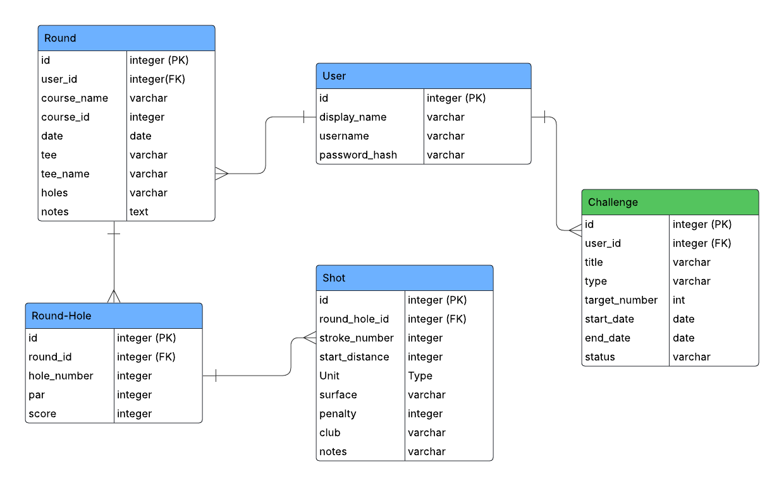

# Paradox Golf

A Meeseeks themed golf tracker application that provides players with a fun and engaging way to track rounds, monitor progress, and challenge themselves without feeling weighed down by golf’s frustrations. Full-stack application built with Python Flask backend and React frontend.

# Features:
Paradox Golf makes improvement enjoyable by combining a playful design with serious insights. Users will see a Meeseeks-themed digital coach that:

*	Tracks golf courses, scores, and personal stats (future upgrades for strokes gained analysis with Golf Data API, Couse data with Golf Course Data API)
*	Analyzes trends across rounds to show progress (average puts, strokes, scores)
*	Celebrates the wins, however big or small, to reinforce motivation
*	Uses authentication to ensure only the user can edit or delete their round data


# Application Flow:
1.	Log In / Sign Up/ Register
-	User creates an account to track rounds or registers
2.	Play a round and log course score card and shots
-	Add courses manually or look them up on course search.
-	Log rounds hole-by-hole (tee box, strokes, putts, fairways, greens)
3.	Track & Improve
-	View stats on dashboard
-	See personalized insights and round highlights
-	View milestones and round highlights
4.	Logout


# Tools and Resources Featured in this Project:
- [GitHub Repo](https://github.com/webdesigns23/paradox-golf-full-stack-auth.git)
- Python 3.8.13+
- Text Editor or IDE (e.g., VS Code)
- Git + GitHub
- Virtualenv
- Python Packages listed in requirements.txt
- React
- React-Router
- Node.js
- [API for course information](golfcourseapi.com)

# Set Up and Installation:
1. Fork and clone the GitHub Repo
```bash
git clone <repo_url>

```
2. Set up your virtual environment of choice (virtualenv prefered)
```bash
virtualenv env1
source env1/bin/activate
```
3. Install PyPi dependencies using requiements.txt
```bash
pip install -r requirements.txt
```
4. Navigate into the server/ directory and set environment variables:
```bash
cd server
export FLASK_APP=app.py
export FLASK_RUN_PORT=5555
```
5. Create a migrations folder, run initial migration and update
```bash
cd server
flask db init
flask db migrate -m "initial migration"
flask db upgrade
```
6. Populate database with initial data
```bash
python seed.py
```
# Running Back-end of Application:
Should run on port 5555 to match proxy in package.json
You can run the Flask server with:
```bash
python app.py
```

# Running Front-end of Application:
To run the React application
1. Install dependencies
```bash
npm install
```
2. Start the application
```bash
npm start
```

# Entity Relationship Diagram:


# API Endpoints and Functionality:
## Authorization/ Authentication:
`POST /signup`
* Registers a new user and creates account

`POST /login`
* Authenticates user when they enter username and password
* Generates a JWT 
* embeds the user’s ID or role

`GET /me`
* Checks login state on page refresh
* Uses JWT

## Round Resource:
`GET /rounds`
* Lists rounds

`GET /rounds/<int:id>`
* Lists specific round

`POST /rounds`
* Creates a round

`PATCH /rounds/<id>`
* Search by id
* Updates Notes only

`DELETE /rounds/<id>`
* Delete a specific round

## RoundHole Resource:
`GET /rounds/<int:round_id>/holes`
* Lists round holes

`POST /rounds/<int:round_id>/holes`
* Create a round hole

## Shots Resource:
`GET /rounds/<int:round_id>/holes/<int:hole_id>/shots`
* Lists shots on round details

`POST /rounds/<int:round_id>/holes/<int:hole_id>/shots`
* Adds shots to a specific round

## CourseSearch (external API) Resource:
`GET /courses/search`
* Searches for course info from GolfCourseAPI


# Testing: 
- Does not contain test files.
- Test in Postman
- Using application in browser and inspect

# Commit and Push Git History if any adjustments to this code are made
1. Add your changes to the staging area by executing
2. Create a commit by executing 
3. Push your commits to GitHub by executing 
4. If you created a separate feature branch, remember to open a PR on main and merge.
```bash
git add .
git commit -m "Your commit message"
git push origin main
```
